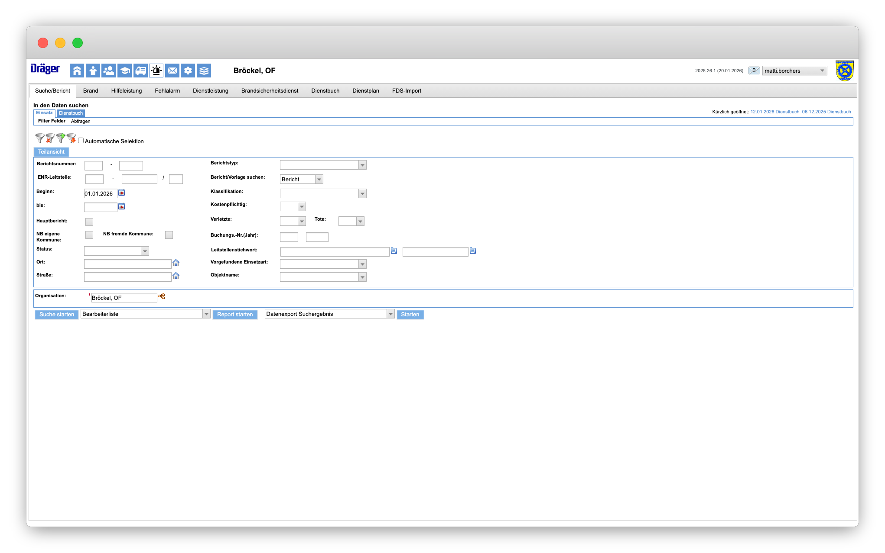
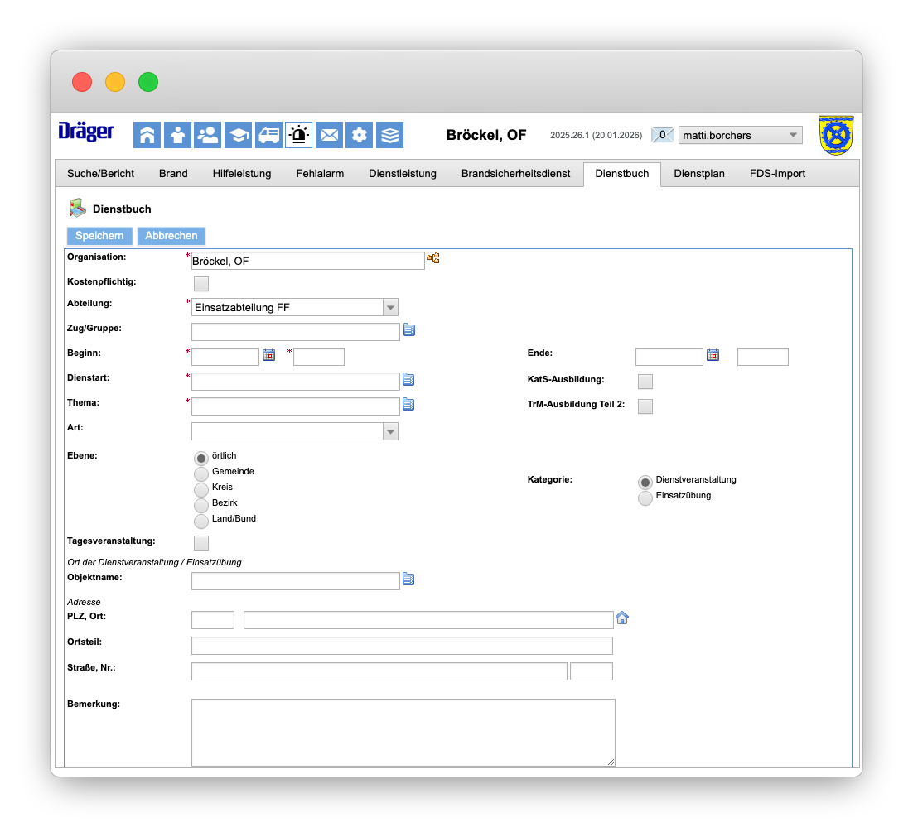

# Dienstbuch

Das Dienstbuch dient der Dokumentation von Ausbildungsdiensten, Übungen und Dienstveranstaltungen. Hier werden durchgeführte Dienste erfasst, Teilnehmende zugeordnet und Dienststunden dokumentiert.

## Einträge suchen

Über das Modul **Berichte** können bestehende Dienstbucheinträge gesucht werden. Im Reiter **Dienstbuch** stehen verschiedene Filterfelder zur Verfügung:

- **Berichtsnummer**: Suche nach einer bestimmten Nummer
- **Beginn/Ende**: Eingrenzung des Zeitraums
- **Bericht/Vorlage suchen**: Auswahl des Berichtstyps

Mit der Schaltfläche **Suche starten** wird die Suche ausgeführt.

## Neuen Eintrag erstellen

Zum Erstellen eines neuen Dienstbucheintrags werden folgende Pflichtfelder ausgefüllt:

- **Organisation**: Die zugehörige Ortsfeuerwehr
- **Abteilung**: z.B. Einsatzabteilung FF
- **Beginn/Ende**: Zeitraum der Veranstaltung
- **Dienstart**: Art des Dienstes (z.B. Ausbildung, Übung)
- **Thema**: Inhalt der Veranstaltung

Optional können weitere Angaben wie **Ebene** (örtlich, Gemeinde, Kreis), **Kategorie** (Dienstveranstaltung, Einsatzübung) und der **Ort** erfasst werden.

Mit **Speichern** wird der Eintrag angelegt.
