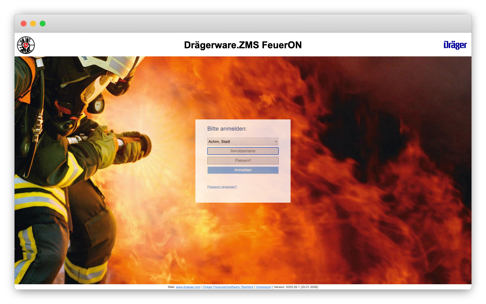

# Anmeldung

Die Anmeldung erfolgt über die Startseite von FeuerON.

[Zur Startseite von FeuerON](https://www.feueron.de/feueron/){ .md-button .md-button--primary }

## Organisation auswählen

Im Feld **Organisation** wird die zugehörige Gemeinde, Samtgemeinde oder Stadt ausgewählt. In unserem Fall ist dies **Flotwedel, Samtgemeinde**. Das Suchfeld oberhalb der Liste erleichtert die Auswahl. FeuerON speichert die zuletzt gewählte Organisation für zukünftige Anmeldungen.

## Zugangsdaten eingeben

Nach Auswahl der Organisation werden **Benutzername** und **Passwort** eingegeben. Mit der Schaltfläche **Anmelden** wird die Anmeldung abgeschlossen.

!!! info "Passwort vergessen"

    Über den Link **Passwort vergessen?** unterhalb der Anmeldemaske kann ein neues Passwort angefordert werden.
